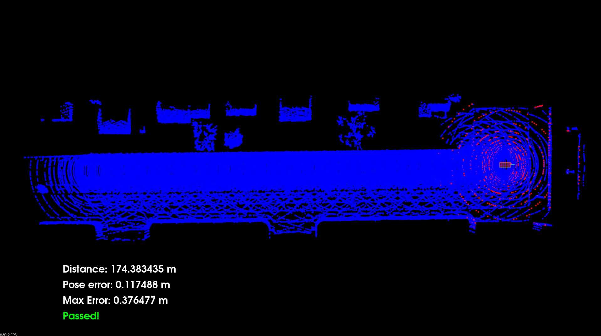

## Running the project

Build the project Docker image using the following command:

```
docker build \
  --tag localization:project \
  --file ./docker/Dockerfile \
  ./docker/
```

Run the project Docker container with the following command:

```
docker run \
  --interactive \
  -tty \
  --volume $PWD:/workspace \
  --volume /tmp/.X11-unix:/tmp/.X11-unix \
  --env DISPLAY=$DISPLAY \
  --env QT_X11_NO_MITSHM=1 \
  --network host \
  --gpus all \
  --privileged \
  localization:project
```

This will start a `bash` terminal inside the container.
You can then build and run the project by running the following commands:

```
./scripts/run.sh
```

## Results

The car was able to drive over 170m with a low max pose error of 0.376m.


